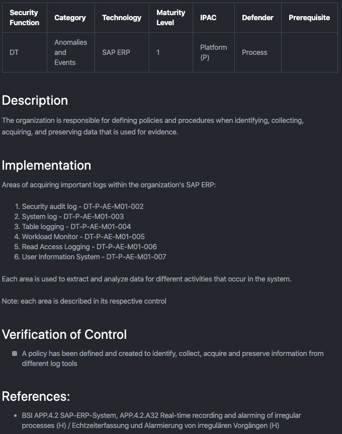

# SAP Security Verification Standard (SSVS)

__*We have included the [OWASP SSVS -
Mapping](https://github.com/NO-MONKEY/CBAS-SAP-SecurityVerificationStandard/blob/master/OWASP%20SSVS%20-%20Mapping.xlsx) file to show the mappings between the different standards and baselines used in the project.*__

 

The CBAS - SAP Security Verification Standard (SSVS) project allows organizations to determine their SAP security posture based on controls used to define a standard security baseline that organizations can maintain and adopt. This enables organizations to plan and enhance their security mechanisms when protecting SAP resources.

## Whats In It For Me (WIIFM)

The project intends to be used by different professionals:

- SAP Security Experts
- non-SAP Security Experts
- Consultants
- Auditors
- Advisors

1. The project helps operations, security, and audit teams assess, plan, and verify security controls that affect SAP implementations in their organizations.
2. Helps organizations determine their maturity in protecting their SAP applications.
3. Enables and supports organizations with implementing security controls that are required to protect their SAP applications.  

## Standard Definition

In our initial release, we want to create a security baseline every organization __must__ maintain to secure SAP applications.

The initial release is derived from the below standards:

- SAP Security Baseline Template V2.4
- German Federal Office for Information Security - BSI 4.2 SAP ERP System
- German Federal Office for Information Security - BSI 4.6 SAP ABAP Programming
- SAP security white papers - used for critical areas missing in the security baseline template and BSI standards
- OWASP Application Security Verification Standard ASVS 2.0
- [NO MONKEY Security Matrix](https://www.no-monkey.com/sap-security-matrix/)

## Controls

We aim to create controls in a structured, easy, and understandable way.

- Every control follows the same identification schema and structure
- Markdown language used for presenting the controls
- Excel tool to present maturity levels, risk areas represented by the [NO MONKEY Security Matrix](https://www.no-monkey.com/sap-security-matrix/), and implementation status

Check our current released controls [here](https://github.com/NO-MONKEY/CBAS-SAP-SecurityMaturityModel/tree/master/Controls_en).

We are continuously adding controls to cover the different maturity levels defined in the project. You can check our [projects](https://github.com/NO-MONKEY/CBAS-SAP-SecurityMaturityModel/projects/1) page to stay updated for upcoming controls.

#### Control Header:

- NIST Security Function
- NIST Category
- [SAP Operational Areas](https://www.no-monkey.com/sap-security-matrix/)
- SAP Technology
- Maturity Level __*(will be removed in the next release)*__
- Defender (People, Process, Technology)
- Control Prerequisite

*[Appendix A](Appendix/Appendix_A_Acronyms.md) lists the acronyms used in either the control header or the naming convention for controls.*

#### Control Structure:

- Description of the control
- Implementing the control
- Verification of the control
- References

#### Example:

 

## Leaders
- [Waseem Ajrab](https://twitter.com/waseem_ajrab)
- [Marco Hammel](https://www.linkedin.com/in/marcohammel/)

## Communication channel

Anyone interested in supporting, contributing or giving feedback join us in our discord channel.

* [Discord Channel](https://discord.gg/8c9jwUQ)

## License

 This work is licensed under a <a rel="license" href="http://creativecommons.org/licenses/by-sa/4.0/">Creative Commons Attribution-ShareAlike 4.0 International License</a>.
